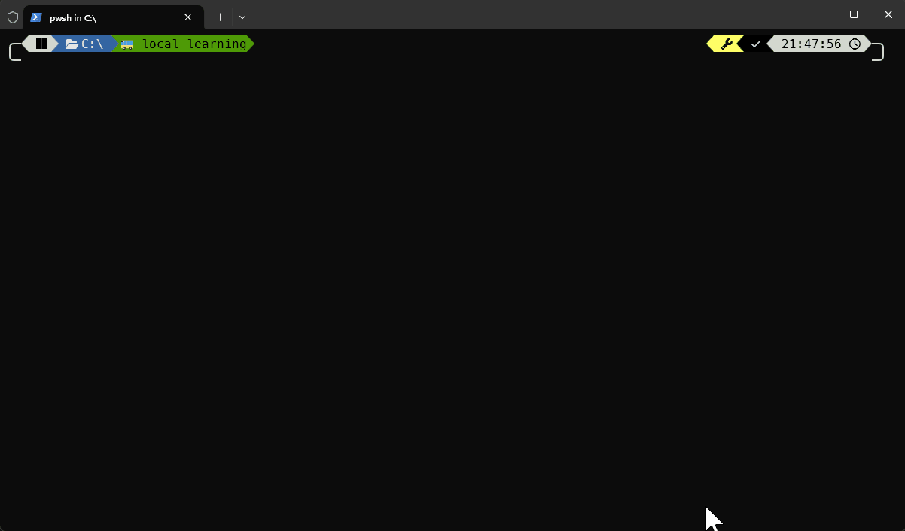

import Tabs from "@theme/Tabs";
import TabItem from "@theme/TabItem";

# Terminal Customizations

If you use **Busly CLI** often, you may want to customize your terminal to always display the currently configured transport and/or service control instance. This is especially helpful to quickly know whether you're pointing to your local or a non-production environment.



## Oh My Posh

Assuming **Oh My Posh** is installed and configured for your shell, you can extend your theme to display the current transport and service control instance in your prompt.

### Shell Profile

Add the following to your shell profile so that Oh My Posh can populate the environment variables used by the theme segments below:

<Tabs groupId="shell">
<TabItem value="powershell" label="PowerShell">

Add to the bottom of your PowerShell profile (`$PROFILE`):

```powershell
function Set-EnvVar([bool]$originalStatus) {
    $env:POSH_BUSLY_TRANSPORT_CURRENT=$(busly transport current)
    $env:POSH_BUSLY_SERVICECONTROL_INSTANCE_CURRENT=$(busly servicecontrol instance current)
}
New-Alias -Name 'Set-PoshContext' -Value 'Set-EnvVar' -Scope Global -Force
```

</TabItem>
<TabItem value="zsh" label="zsh">

Add to the bottom of your `~/.zshrc`:

```bash
function set_poshcontext() {
    export POSH_BUSLY_TRANSPORT_CURRENT=$(busly transport current)
    export POSH_BUSLY_SERVICECONTROL_INSTANCE_CURRENT=$(busly servicecontrol instance current)
}
```

</TabItem>
<TabItem value="bash" label="bash">

Add to the bottom of your `~/.bashrc`:

```bash
function set_poshcontext() {
    export POSH_BUSLY_TRANSPORT_CURRENT=$(busly transport current)
    export POSH_BUSLY_SERVICECONTROL_INSTANCE_CURRENT=$(busly servicecontrol instance current)
}
```

</TabItem>
<TabItem value="fish" label="fish">

Add to the bottom of your `~/.config/fish/config.fish`:

```shell
function set_poshcontext
    set --export POSH_BUSLY_TRANSPORT_CURRENT $(busly transport current)
    set --export POSH_BUSLY_SERVICECONTROL_INSTANCE_CURRENT $(busly servicecontrol instance current)
end
```

</TabItem>
<TabItem value="nu" label="nu">

Add to the bottom of your Nushell `env.nu`:

```bash
$env.SET_POSHCONTEXT = {
    $env.POSH_BUSLY_TRANSPORT_CURRENT = (busly transport current);
    $env.POSH_BUSLY_SERVICECONTROL_INSTANCE_CURRENT = (busly servicecontrol instance current);
}
```

</TabItem>
</Tabs>

### Theme Configuration

Add the following segments to your Oh My Posh theme JSON:

```json
{
  "$schema": "https://raw.githubusercontent.com/JanDeDobbeleer/oh-my-posh/main/themes/schema.json",
  "blocks": [
    {
      "type": "prompt",
      "alignment": "left",
      "segments": [
        // ... your existing segments ...
        {
          "type": "text",
          "style": "powerline",
          "powerline_symbol": "\ue0b0",
          "background": "#4e9a06",
          "foreground": "#000000",
          "template": "🚌 {{ .Env.POSH_BUSLY_TRANSPORT_CURRENT }}"
        },
        {
          "type": "text",
          "style": "powerline",
          "powerline_symbol": "\ue0b0",
          "background": "#3465a4",
          "foreground": "#ffffff",
          "template": "\uf233 {{ .Env.POSH_BUSLY_SERVICECONTROL_INSTANCE_CURRENT }}"
        },
      ]
    }
  ],
  "final_space": true
}
```
